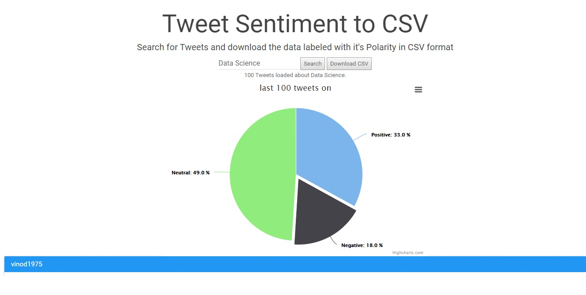
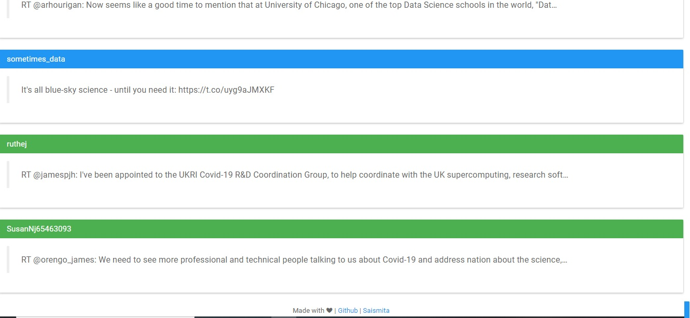

# Tweet-Sentiment-Analysis
This project uses twitter search API from tweepy, Searches for Tweets and gives the option to the user to downloads the data labeled with it's Polarity in CSV format.

# Development Guide
Create a virtualenv. virtualenv venv
Activate venv. source venv/bin/activate
Install the requirements. pip install -r requirements.txt
Save the ACCESS_TOKEN, ACCESS_TOKEN_SECRET, CONSUMER_KEY, CONSUMER_SECRET as environment variables. You can follow this guide for Heroku.
Run the server. python app.py
